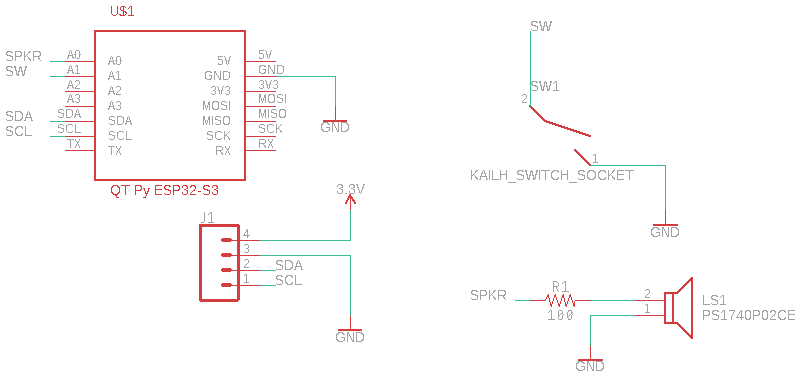

# SwitchTest

An open-source mechanical keyswitch tester.

## Purpose

To provide a simple, reliable, and fast way to test a batch of keyswitches. You might want to perform batch testing after opening the switch housings in order to lubricate or swap springs. It can also be useful for those who buy and sell keyswitches, to quickly check them after receipt or before shipping.

## Bill of Materials

| Qty | Part                                                                          | Notes                            |
| --- | ----------------------------------------------------------------------------- | -------------------------------- |
| 1   | [10k Ohm Resistor](https://www.amazon.com/dp/B072BL2VX1)                      | Through-hole, 1/4W is sufficient |
| 1   | [PS1240P02CT3](https://www.mouser.com/ProductDetail/810-PS1240P02CT3)         | Piezo buzzer, 4kHz               |
| 1   | [QT Py ESP32-S3](https://www.adafruit.com/product/5426)                       |                                  |
| 1   | [0.96" SSD1306 OLED](https://www.amazon.com/gp/product/B0837DLWVH)            |                                  |
| 1   | [Kailh hotswap socket](https://divinikey.com/products/kailh-hot-swap-sockets) |                                  |
| 4   | [M3 Standoffs](https://www.amazon.com/dp/B098XS4C3D)                          | 8-15mm length                    |
| 8   | M3 Screws                                                                     | 5mm length                       |

You will also need a 3D printed [baseplate](./hardware/baseplate.stl).

Finally, PCBs are available from [this repo](./hardware/tester.brd).

## Schematic

EAGLE schematics are available [here](./hardware/tester.sch).

## Assembly

1. Solder the resistor, OLED, and QT Py to the top of the board.
2. Solder the buzzer and switch socket to the bottom of the board.
3. Attach standoffs to the board.
4. Attach baseplate to the other end of the standoffs.

## Usage

1. Plug the board in to a USB-C cable.
2. Wait for the red LED.
3. Install a switch in the socket and press it. If the light turns green and the buzzer sounds, it is working. Otherwise, it is not.
4. Remove the switch and repeat step 3 for each switch.
